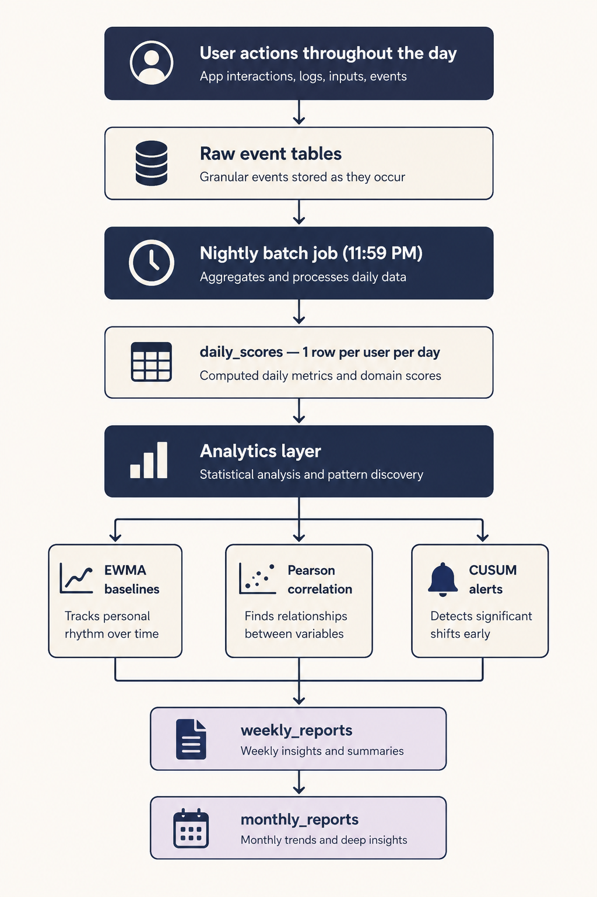

# Me vs Me — Data Architecture



## The Core Principle

Every user action writes to a raw event table. Every night at 11:59 PM a batch job reads all events for that day and produces **one clean row** in `daily_scores`. One row per user per day.

Every algorithm, every report, every insight reads **only from `daily_scores`**. Never from raw event tables directly.

```
User actions throughout the day
            ↓
    Raw event tables
            ↓
  Nightly batch job (11:59 PM)
            ↓
   daily_scores — 1 row per user per day
            ↓
      Analytics layer
     ↙        ↓        ↘
EWMA      Pearson     CUSUM
baselines correlation  alerts
            ↓
    weekly_reports
    monthly_reports
```

**Why this matters:**
- Analytics is fast — reads one clean table, not joining 10 raw tables
- Traceable — if an insight looks wrong, trace it to one column in one row
- Recomputable — if raw events have issues, `daily_scores` can be rebuilt
- Testable — every algorithm has a single, predictable input

---

## Layer 1 — Raw Event Tables

These capture what the user actually did. Written to in real time throughout the day. Never read by analytics directly.

### `users`
| Column | Type | What it stores |
|--------|------|---------------|
| `user_id` | UUID | Primary key |
| `user_type` | ENUM | `student` / `working` / `homemaker` |
| `user_subtype` | ENUM | e.g. `competitive_exam`, `salaried` |
| `tone_preference` | ENUM | `push_me` / `straight` / `be_kind` |
| `character_type` | ENUM | `dad` / `mom` / `best_friend` / `partner` / `sibling` / `mentor` |
| `character_unlock_day` | INT | Current reveal progress 0–7 |
| `character_unlocked` | BOOL | True after 7 logged days |
| `report_day` | ENUM | Chosen weekly report day |
| `created_at` | TIMESTAMP | Signup date |

---

### `onboarding_baseline`
| Column | Type | What it stores |
|--------|------|---------------|
| `user_id` | UUID | FK → users |
| `best_period_text` | TEXT | Free text — stored verbatim, never modified |
| `extracted_health_signals` | JSONB | Haiku extraction from best period text |
| `extracted_career_signals` | JSONB | Haiku extraction from best period text |
| `extraction_confidence` | FLOAT | 0–1. Below 0.4 triggered follow-up question |
| `best_focus_h` | FLOAT | Ceiling for career domain |
| `current_focus_h` | FLOAT | Half of EWMA seed |
| `best_sleep_h` | FLOAT | Ceiling for health domain |
| `current_sleep_h` | FLOAT | Half of EWMA seed |
| `best_steps` | INT | Ceiling for steps |
| `current_steps` | INT | Half of EWMA seed |
| `ewma_seed_focus` | FLOAT | (best + current) / 2 — days 1–6 baseline |
| `ewma_seed_sleep` | FLOAT | (best + current) / 2 — days 1–6 baseline |
| `ewma_seed_steps` | FLOAT | (best + current) / 2 — days 1–6 baseline |
| `primary_blocker` | ENUM | Routes week 1 notifications |
| `synthetic_me_score` | FLOAT | Day 1 hook number — estimate only |

---

### `user_domains`
| Column | Type | What it stores |
|--------|------|---------------|
| `user_id` | UUID | FK → users |
| `domain` | ENUM | `health` / `career` |
| `weight` | INT | 0–100. health + career = 100 always |
| `label` | TEXT | e.g. `career` / `personal_growth` |

---

### `alarm_events`
| Column | Type | What it stores |
|--------|------|---------------|
| `alarm_id` | UUID | Primary key |
| `user_id` | UUID | FK → users |
| `date` | DATE | Which day |
| `intended_wake_time` | TIMESTAMP | Set the night before |
| `actual_wake_time` | TIMESTAMP | When they tapped Yes or logged manually |
| `wake_delta_min` | INT | actual − intended. Positive = late. Negative = early. |
| `wake_logged` | BOOL | False if they never tapped the notification |

---

### `morning_stamps`
| Column | Type | What it stores |
|--------|------|---------------|
| `stamp_id` | UUID | Primary key |
| `user_id` | UUID | FK → users |
| `date` | DATE | Which day |
| `day_type` | ENUM | `deep_focus` / `mixed` / `recovery` |
| `stamp_time` | TIMESTAMP | When they stamped — late stamps correlate with lower completion |

---

### `focus_sessions`
| Column | Type | What it stores |
|--------|------|---------------|
| `session_id` | UUID | Primary key |
| `user_id` | UUID | FK → users |
| `goal_id` | UUID | FK → goals (nullable — session may be unlinked) |
| `date` | DATE | Which day |
| `start_time` | TIMESTAMP | Session start |
| `end_time` | TIMESTAMP | Session end |
| `actual_duration_min` | INT | end − start in minutes |
| `planned_duration_min` | INT | How long they intended when they started |
| `quality_self_reported` | INT | 1–5 (Scattered → Flow) — user tap |
| `quality_behavioral` | FLOAT | Computed proxy from completion + interruptions |
| `quality_divergence` | FLOAT | self_reported − behavioral |
| `quality_anomaly` | BOOL | True if divergence > 1.5 consistently |
| `session_focus_score` | FLOAT | actual_duration_min × quality_self_reported |
| `interrupted` | BOOL | Did they stop early unexpectedly |
| `interruption_type` | ENUM | `distraction` / `external` |
| `interruption_note` | TEXT | Free text — "power cut", "friend visited" — verbatim |
| `context_location` | ENUM | `home` / `library` / `cafe` / `other` — optional |

---

### `goals`
| Column | Type | What it stores |
|--------|------|---------------|
| `goal_id` | UUID | Primary key |
| `user_id` | UUID | FK → users |
| `goal_name` | TEXT | "Learn AWS" |
| `goal_type` | ENUM | `daily` / `weekly` / `monthly` / `custom` |
| `period_start` | DATE | — |
| `period_end` | DATE | — |
| `reminder_days` | JSONB | `["tuesday", "friday"]` — weekly/monthly goals only |
| `status` | ENUM | `active` / `completed` / `cancelled` / `carried` |
| `carried_over` | BOOL | True if session was skipped and moved to next day |
| `created_at` | TIMESTAMP | — |

---

### `goal_sessions`
| Column | Type | What it stores |
|--------|------|---------------|
| `session_id` | UUID | Primary key |
| `goal_id` | UUID | FK → goals |
| `date` | DATE | Which day |
| `planned_start` | TIMESTAMP | — |
| `planned_end` | TIMESTAMP | — |
| `actual_start` | TIMESTAMP | — |
| `actual_end` | TIMESTAMP | — |
| `status` | ENUM | `completed` / `partial` / `skipped` / `cancelled` |
| `quality_rating` | ENUM | `scattered` / `distracted` / `solid` / `focused` / `flow` |

---

### `subtasks`
| Column | Type | What it stores |
|--------|------|---------------|
| `subtask_id` | UUID | Primary key |
| `session_id` | UUID | FK → goal_sessions |
| `title` | TEXT | "Complete GraphQL" |
| `planned_start` | TIMESTAMP | — |
| `planned_end` | TIMESTAMP | — |
| `actual_end` | TIMESTAMP | When marked done or rescheduled |
| `completion_weight` | FLOAT | block_duration / total_session_duration × 100 |
| `ai_generated` | BOOL | True if Haiku generated it |
| `user_edited` | BOOL | True if user changed time or title |
| `status` | ENUM | `completed` / `skipped` / `rescheduled` |
| `reschedule_reason` | ENUM | `distracted` / `harder_than_expected` / `something_came_up` / `out_of_time` |

---


### `evening_checkins`
| Column | Type | What it stores |
|--------|------|---------------|
| `checkin_id` | UUID | Primary key |
| `user_id` | UUID | FK → users |
| `date` | DATE | Which day |
| `productiveness_rating` | INT | 1–5 |
| `contentment_rating` | INT | 1–5 |
| `gap` | INT | productiveness − contentment |
| `blocker_text` | TEXT | Free text — optional, verbatim |
| `checkin_time` | TIMESTAMP | Late check-ins (after 11 PM) flagged |

---

### `sleep_events`
| Column | Type | What it stores |
|--------|------|---------------|
| `sleep_id` | UUID | Primary key |
| `user_id` | UUID | FK → users |
| `date` | DATE | Which night |
| `declared_sleep_time` | TIMESTAMP | When they tapped "Going to sleep" |

---

### `post_sleep_app_events`
| Column | Type | What it stores |
|--------|------|---------------|
| `event_id` | UUID | Primary key |
| `user_id` | UUID | FK → users |
| `date` | DATE | Which night |
| `app_name` | TEXT | e.g. "Instagram" |
| `category` | ENUM | `reels_shorts` / `social_scroll` / `messaging` / `gaming` / `video_long` / `reading` / `browsing` |
| `duration_min` | INT | Time in that app |
| `opened_at` | TIMESTAMP | When they opened it post-declaration |

---

### `passive_health`
| Column | Type | What it stores |
|--------|------|---------------|
| `user_id` | UUID | FK → users |
| `date` | DATE | Which day |
| `sleep_h` | FLOAT | From Apple Health / Google Fit |
| `steps` | INT | Step count for the day |
| `source` | TEXT | `apple_health` / `google_fit` / `manual` |

---

### `notification_events`
Feeds Thompson Sampling — which hour gets a response within 30 minutes.

| Column | Type | What it stores |
|--------|------|---------------|
| `event_id` | UUID | Primary key |
| `user_id` | UUID | FK → users |
| `notification_type` | ENUM | `morning_wake` / `block_tick` / `evening_checkin` / `sleep` |
| `sent_at` | TIMESTAMP | When notification was sent |
| `hour_slot` | INT | 0–23 — which hour it was sent |
| `responded` | BOOL | Did user tap within 30 minutes |
| `alpha` | INT | Running count of responses for this slot |
| `beta` | INT | Running count of non-responses for this slot |

---

## Layer 2 — The Nightly Batch Job

Runs every night at **11:59 PM** per user. Reads all raw events for that day. Produces one row in `daily_scores`. Updates all baselines.

```
For each user, for today:

1. Read alarm_events       → wake_delta_min
2. Read morning_stamps     → day_type
3. Read focus_sessions     → SUM(session_focus_score) = daily_focus_score
4. Read passive_health     → sleep_h, steps
5. Read evening_checkins   → productiveness_rating, contentment_rating
6. Read sleep_events       → declared_sleep_time
7. Read post_sleep_events  → total_post_sleep_screen_min

8. Compute health_index:
   sleep_score = min((sleep_h / 8.0) × 100, 100)
   steps_score = min((steps / 10000) × 100, 100)
   health_index = (sleep_score × 0.70) + (steps_score × 0.30)

9. Write one row → daily_scores

10. If day_type ≠ recovery AND evening_checkin completed:
    → Update EWMA baselines in user_baselines
    → Increment days_logged

11. Run CUSUM check against updated baselines
    → Write to user_alerts if threshold crossed

12. If days_logged ≥ 21:
    → Run Pearson correlation update
    → Write significant pairs to user_correlations
```

---

## Layer 3 — `daily_scores` (The Central Table)

**One row per user per day. Every algorithm reads from here.**

| Column | Type | Source | What it represents |
|--------|------|--------|-------------------|
| `user_id` | UUID | — | — |
| `date` | DATE | — | — |
| `day_type` | ENUM | morning_stamps | `deep_focus` / `mixed` / `recovery` / null |
| `wake_delta_min` | INT | alarm_events | Minutes late or early vs intention |
| `daily_focus_score` | FLOAT | focus_sessions | SUM of (duration × quality) |
| `focus_sessions_count` | INT | focus_sessions | How many sessions that day |
| `sleep_h` | FLOAT | passive_health | Hours slept |
| `steps` | INT | passive_health | Step count |
| `sleep_score` | FLOAT | computed | 0–100 |
| `steps_score` | FLOAT | computed | 0–100 |
| `health_index` | FLOAT | computed | 0–100 |
| `productiveness_rating` | INT | evening_checkins | 1–5, null if skipped |
| `contentment_rating` | INT | evening_checkins | 1–5, null if skipped |
| `contentment_gap` | INT | computed | productiveness − contentment |
| `goals_planned` | INT | goal_sessions | Blocks planned for today |
| `goals_completed` | INT | goal_sessions | Blocks marked done |
| `goal_completion_rate` | FLOAT | computed | completed / planned |
| `post_sleep_screen_min` | INT | post_sleep_app_events | Phone use after declaring sleep |
| `is_recovery_day` | BOOL | morning_stamps | True → excluded from EWMA update |
| `evening_checkin_completed` | BOOL | evening_checkins | True → increments days_logged |

---

## Layer 4 — Analytics Tables

These are computed from `daily_scores`. Never written to in real time — updated nightly or weekly.

### `user_baselines`
One row per user per metric. Updated every night by the batch job (excluding recovery days).

| Column | Type | What it stores |
|--------|------|---------------|
| `user_id` | UUID | — |
| `metric` | TEXT | `focus_score` / `health_index` / `contentment` |
| `ewma_value` | FLOAT | Current rolling baseline |
| `ewma_seed` | FLOAT | Onboarding seed — fades out by day 21 |
| `updated_at` | DATE | Last update |

**Formula:** `S_t = (0.1 × today) + (0.9 × yesterday_baseline)`

---

### `user_correlations`
Pearson r values for insight generation. Written weekly when N ≥ 21, |r| > 0.5, p < 0.05.

| Column | Type | What it stores |
|--------|------|---------------|
| `user_id` | UUID | — |
| `feature_x` | TEXT | e.g. `sleep_h[day-1]` |
| `feature_y` | TEXT | e.g. `daily_focus_score` |
| `r_value` | FLOAT | Pearson coefficient |
| `p_value` | FLOAT | Statistical significance |
| `n_points` | INT | Data points used |
| `computed_at` | DATE | — |

**Pairs tested:**
- `sleep_h[day-1]` vs `daily_focus_score[day]`
- `post_sleep_screen_min` vs `wake_delta_min` (next morning)
- `goal_completion_rate` vs `contentment_rating` (same day)
- `wake_delta_min` vs `daily_focus_score`

---

### `user_alerts`
CUSUM-triggered drift alerts. Sparse — only written when threshold crossed.

| Column | Type | What it stores |
|--------|------|---------------|
| `alert_id` | UUID | — |
| `user_id` | UUID | — |
| `metric` | TEXT | Which metric drifted |
| `days_below_baseline` | INT | Consecutive days below EWMA |
| `cusum_value` | FLOAT | Running sum at time of alert |
| `triggered_at` | DATE | — |
| `resolved` | BOOL | True when metric recovers |

**Thresholds:**
- 7 consecutive days below baseline → gentle nudge in weekly report
- 14 consecutive days → deeper wellbeing check-in surfaced

---

### `user_operating_manual`
K-means clustering output. Day 90+ premium feature only. One row per user.

| Column | Type | What it stores |
|--------|------|---------------|
| `user_id` | UUID | — |
| `best_day_sleep_range` | TEXT | e.g. "7.0–7.5h" |
| `best_day_first_session_before` | TIME | e.g. "9:30 AM" |
| `conditions_present_on_pct` | FLOAT | % of top days these conditions appeared |
| `computed_at` | DATE | When K-means ran |

---

## Layer 5 — Report Tables

### `weekly_reports`
Generated on the user's chosen report day if `days_logged_this_week ≥ 4`.

| Column | Type | What it stores |
|--------|------|---------------|
| `user_id` | UUID | — |
| `week_start` | DATE | Monday of the report week |
| `week_end` | DATE | The chosen report day |
| `days_logged_this_week` | INT | Evening check-ins completed |
| `report_generated` | BOOL | False if days_logged < 4 |
| `career_domain` | FLOAT | 0–100 |
| `health_domain` | FLOAT | 0–100 |
| `me_score` | FLOAT | 20–100 |
| `me_score_delta` | FLOAT | vs previous week |
| `personal_best` | FLOAT | All-time highest me_score |
| `pct_of_personal_best` | FLOAT | me_score / personal_best × 100 |
| `biggest_correlation` | TEXT | Human-readable insight sentence |
| `best_day_date` | DATE | Highest daily_score this week |
| `contentment_avg` | FLOAT | Week average |
| `productiveness_avg` | FLOAT | Week average |
| `contentment_gap_avg` | FLOAT | Week average of the gap |

---

### `monthly_reports`
Generated last Sunday of each month.

| Column | Type | What it stores |
|--------|------|---------------|
| `user_id` | UUID | — |
| `month_start` | DATE | First day of month |
| `avg_me_score` | FLOAT | Average weekly Me Score across the month |
| `mom_delta` | FLOAT | vs previous month |
| `best_day_date` | DATE | Highest daily_score in the month |
| `best_week_start` | DATE | Highest-scoring week |
| `biggest_pattern` | TEXT | Correlation that needed the full month — human-readable |
| `behaviour_shifts` | JSONB | `{"wake_delta_trend": "improving", "contentment_trend": "up"}` |

---

## Data Flow Summary

| What user does | Where it lands | When it's computed |
|---------------|---------------|-------------------|
| Wakes up, logs wake time | `alarm_events` | Immediately |
| Taps day type | `morning_stamps` | Immediately |
| Starts/ends focus session | `focus_sessions` | Immediately |
| Taps subtask done/skip | `subtasks` | Immediately |
| Evening check-in | `evening_checkins` | Immediately |
| Taps "Going to sleep" | `sleep_events` | Immediately |
| Opens apps after sleep | `post_sleep_app_events` | Passively, Android only |
| Steps + sleep from phone | `passive_health` | Synced from Health API |
| — | `daily_scores` | 11:59 PM nightly batch |
| — | `user_baselines` (EWMA) | Nightly, after daily_scores |
| — | `user_correlations` | Weekly, if N ≥ 21 |
| — | `user_alerts` (CUSUM) | Nightly check |
| — | `weekly_reports` | User's chosen report day |
| — | `monthly_reports` | Last Sunday of month |
| — | `user_operating_manual` | Day 90+, premium only |

---

## Analytics Deep Dive

---

## EWMA Baselines — Tracks personal rhythm over time

**What it is:**
EWMA stands for Exponentially Weighted Moving Average. Every night after your data is logged, the app updates your personal baseline for each metric using this formula:

```
S_t = (0.1 × today's score) + (0.9 × yesterday's baseline)
```

The 0.1 and 0.9 are fixed weights. Recent days matter more than older ones, but no single day dominates.

**What it produces:**
A rolling baseline for focus, health, and contentment — updated every night. This IS your personal rhythm. Not what you said your average was. Not a population benchmark. What your actual logged data says you consistently do.

**Why 0.1 and 0.9 specifically:**
This gives approximately 19 days of effective memory. Recent enough to reflect genuine change in your habits. Stable enough that one terrible day doesn't collapse your baseline. A λ of 0.2 would give only 9 days — too reactive. A λ of 0.05 would give 38 days — too slow to reflect real change.

**Concrete example:**
Your focus baseline is 310 (your rhythm). You have a great week and average 380. Next day your EWMA shifts to:
`(0.1 × 380) + (0.9 × 310) = 38 + 279 = 317`
One good week moves the baseline slightly upward — not dramatically. That's correct. Sustained improvement should move it, not one good day.

**Recovery days excluded:**
Days stamped as Recovery are excluded from the EWMA update. Intentional rest should never pull your rhythm down.

---

## Pearson Correlation — Finds relationships between variables

**What it is:**
Pearson correlation measures how strongly two signals move together — producing a number between −1 and +1. A value close to 1 means when one goes up, the other goes up consistently. Close to 0 means they move independently.

**The 1-day lag:**
Me vs Me deliberately tests yesterday's value against today's outcome. Not the same day. This captures causal direction — sleep last night affects focus today, not the other way around.

**Variable pairs tested:**
- `sleep_h [yesterday]` → `daily_focus_score [today]`
- `wake_delta_min [day]` → `daily_focus_score [same day]`
- `post_sleep_screen_min [night]` → `wake_delta_min [next morning]`
- `goal_completion_rate [day]` → `contentment_rating [same day]`

**Three guards before anything is shown:**

| Guard | Threshold | Why |
|-------|-----------|-----|
| Minimum data points | N ≥ 21 | Below this, any correlation can be coincidence |
| Effect size | \|r\| > 0.5 | Weak correlations are not shown — only moderate to strong |
| Statistical significance | p < 0.05 | Less than 5% chance the pattern is noise |

All three must pass. If any fails, nothing is surfaced. The user never sees a spurious correlation.

**Concrete example:**
After 6 weeks the app computes:
- r = −0.71 between `wake_delta_min` and `daily_focus_score`
- p = 0.003, N = 38

All three guards pass. The weekly report says:
> "On days you woke 30+ minutes later than planned, your focus was 31% below your rhythm. This appeared 14 times in 6 weeks. Your data — not a general study."

No LLM generated this. Pearson found the number. A template filled the sentence.

---

## CUSUM Alerts — Detects significant shifts early

**What it is:**
CUSUM stands for Cumulative Sum. It is a statistical method originally developed for manufacturing quality control (Page, 1954) and now used in ICU patient deterioration monitoring. Me vs Me applies it to behavioural data.

**The problem it solves:**
Daily checks miss gradual decline. A single bad day is noise. But seven consecutive days slightly below your baseline is a real pattern — and without CUSUM, the app would never catch it because no single day looks alarming.

**The analogy:**
A weight scale. Up 200g today — not concerning. But up 200g every day for 10 days straight — something real is happening. CUSUM keeps a running sum of how far below your baseline you are. When that cumulative sum crosses a threshold, the drift is confirmed as real and sustained.

**The formula:**
```
C⁻_t = max(0, C⁻_{t-1} − (X_t − μ₀ + k))

where:
  μ₀ = your EWMA baseline
  k  = 0.5σ (half your standard deviation — sensitivity tuning)
  alert when C⁻_t > h = 5σ
```

**What it triggers:**

| Condition | Response |
|-----------|----------|
| 7 consecutive days below baseline | Gentle nudge in weekly report — "Your focus has been below your rhythm this week. One small thing:" |
| 14 consecutive days below baseline | Deeper wellbeing check-in surfaced — "This has been going on a while. What's getting in the way?" |

Language is always observation. Never "you are doing badly."

**Why not just show a down arrow in the weekly report?**
A down arrow this week vs last week could be one bad Sunday pulling the average. CUSUM confirms the decline is sustained across multiple days — a meaningfully different signal that a simple week-over-week comparison misses entirely.

---

## Analytics Deep Dive — Thompson Sampling (Notification Timing)

**What problem it solves:**

Sending a notification at 8 AM works for one person and gets ignored by another. Most apps send at a fixed time or let the user pick a time they forget to honour. Thompson Sampling learns — from the user's own behaviour — exactly which hour they are most likely to open a nudge and act on it.

This is genuine ML. Not a rule. Not a schedule. The app is running a live experiment on every user every day, updating its model with each result.

---

**The mechanism — Beta distribution per hour slot:**

For every user, for every hour of the day (24 slots), the app maintains two counters:

```
α (alpha) = number of times a notification in this slot got a response
β (beta)  = number of times a notification in this slot was ignored
```

When it is time to send a notification, the app:
1. For each hour slot, draws a random sample from Beta(α + 1, β + 1)
2. Sends to whichever hour slot drew the highest sample
3. Observes the result (opened? acted? ignored?)
4. Updates that slot's α or β accordingly

```
If user responded → α += 1
If user ignored   → β += 1
```

**Why Beta(α+1, β+1) and not just pick the highest success rate?**

Because early on, every slot has thin data. A slot that has been tried once and happened to get a response would have a 100% success rate — but that is noise, not signal. The Beta distribution reflects uncertainty. A slot with α=1, β=0 will draw widely varying samples (it could be anywhere from 0 to 1). A slot with α=40, β=5 will draw tightly around 0.89. The algorithm naturally explores slots it has not tried enough, and exploits slots it is confident about.

This is the **explore-exploit balance** — the defining property of bandit algorithms.

---

**Concrete walkthrough:**

| Hour slot | α | β | Typical sample range |
|-----------|---|---|---------------------|
| 7 AM | 2 | 8 | 0.10 – 0.35 — rarely drawn |
| 9 AM | 12 | 3 | 0.65 – 0.85 — often drawn |
| 10 AM | 1 | 1 | 0.15 – 0.75 — uncertain, sometimes tried |
| 8 PM | 18 | 2 | 0.78 – 0.92 — frequently drawn |

The algorithm has learned this user responds best at 9 AM and 8 PM. It will mostly send there, but occasionally test 10 AM in case something has changed.

---

**What counts as a "response":**

| Notification type | Positive signal | Negative signal |
|-------------------|----------------|----------------|
| Evening check-in | Opens app within 10 min | No open within 30 min |
| Session reminder | Session logged within 15 min | No session for 1 hour |
| Weekly report | Report opened | Not opened by end of day |

A notification opened two hours later is treated as ignored — the intent is to catch the user at a moment they are receptive, not just to track eventual opens.

---

**What the data looks like:**

```
user_notification_slots table
─────────────────────────────────────────────
user_id        UUID
hour_slot      INT   0–23
alpha          INT   starts at 1
beta           INT   starts at 1
last_updated   TIMESTAMP
```

All 24 rows created on signup with α=1, β=1 (uniform — no preference assumed). Within 2–3 weeks of usage, the distribution becomes meaningfully personalised.

---

**Why this matters for retention:**

Notifications sent at the wrong moment train users to ignore notifications. Thompson Sampling converges toward the user's real receptive window without asking them a question they cannot accurately answer. The result is higher open rates, more evening check-ins completed, and a better product experience — all from a table with 24 rows and two integers.

---

## Analytics Deep Dive — K-means Clustering (Personal Operating Manual)

**What problem it solves:**

After 90 days of logged data, the app has enough signal to ask a different question: not "how are you doing vs your rhythm?" but "what actually made your best days possible?"

Most people cannot answer this accurately from memory. They think they know — but memory is selective and biased toward recent or emotionally vivid days. K-means finds the answer in the data.

This is a premium feature, unlocked at day 90.

---

**The setup — finding top-quartile days:**

First, the app selects all days where the Me Score was in the **top 25%** across the user's full history.

```
Minimum requirements:
  → 90 days logged
  → At least 15 top-quartile days (otherwise the cluster is too small to mean anything)
```

If the user does not yet meet these thresholds, the feature does not appear. No empty states, no "come back later." The character just has not written this chapter yet.

---

**The input features — what each day is described by:**

```
For each top-quartile day, extract:

  sleep_h             → How long did they sleep?
  wake_delta_min      → Did they wake before or after their intended time?
  first_session_start → What time did the first focus session begin?
  session_count       → How many sessions that day?
  total_focus_min     → Total focus time (not quality-weighted)
  avg_quality         → Average quality rating across sessions
  steps               → Step count
  day_type            → Deep Focus / Mixed / Recovery (encoded as 0/1/2)
  day_of_week         → Encoded as 0–6
```

These are the conditions of the day — not the outputs. The output (Me Score) was already used to select the days. K-means clusters the conditions that came before the score.

---

**The algorithm — K=2:**

K-means splits the top-quartile days into **2 clusters**:

```
1. Initialise 2 centroids randomly among the selected days
2. Assign each day to the nearest centroid (Euclidean distance)
3. Recompute each centroid as the mean of its assigned days
4. Repeat until assignments stabilise
5. Label the centroid with the higher average Me Score as "Profile A"
   and the other as "Profile B"
```

K=2 is fixed. More clusters would produce over-specific profiles the user cannot act on. Two clusters gives: your best-day template, and a secondary pattern for when you are still performing well but differently.

---

**What the centroid becomes — the Personal Operating Manual:**

Each centroid is a vector of average values. Translated to human language:

```
Your best days look like this:

  Sleep           → 7.2 hours
  Wake time       → Within 5 minutes of your alarm
  First session   → Before 9:15 AM
  Sessions        → 2–3 per day
  Total focus     → 2h 40m
  Quality         → Mostly Focused or Flow
  Steps           → 8,200+
  Day type        → Deep Focus
```

This is the user's **Personal Operating Manual** — a profile derived entirely from their own data, describing what conditions tend to precede their best days.

---

**What the data looks like:**

```
user_operating_manual table
────────────────────────────────────────────
user_id              UUID
generated_at         TIMESTAMP
days_analysed        INT     e.g. 97
top_quartile_days    INT     e.g. 24
cluster_id           INT     1 or 2
avg_sleep_h          FLOAT
avg_wake_delta_min   FLOAT
avg_first_session    TIME
avg_session_count    FLOAT
avg_total_focus_min  FLOAT
avg_quality          FLOAT
avg_steps            INT
dominant_day_type    TEXT
profile_label        TEXT    "Profile A" / "Profile B"
```

One row per cluster. Two rows per user once unlocked.

---

**Worked example — what a user sees:**

> **Your Personal Operating Manual** *(unlocked — Day 94)*
>
> After 94 days, here is what your best days actually had in common.
>
> **Profile A — Your peak days (15 of your top days)**
> You slept 7–7.5 hours. You started your first session before 9 AM.
> You walked at least 8,000 steps. You had 2–3 sessions, not more.
>
> **Profile B — Your strong alternate days (9 of your top days)**
> You slept 6.5–7 hours. You started later (after 10 AM) but had longer, higher-quality sessions.
> Steps were lower — these were high-output sedentary days.
>
> *This is not a prescription. It is a pattern. Use it however feels right.*

---

**Why K-means and not a fancier model:**

| Approach | Why not |
|----------|---------|
| Linear regression | Tells you which variables correlate — not what a "best day profile" looks like as a cluster |
| Neural network | Needs far more data, uninterpretable output — the user cannot act on a weight matrix |
| Decision tree | Could work, but produces rules ("if sleep > 7h AND steps > 8000…") that feel clinical |
| K-means (K=2) | Produces two human-readable centroid profiles. Minimal data requirement. Fast. Interpretable. |

The goal is a result the user can read in 30 seconds and act on tomorrow. K-means with K=2 is the simplest model that produces exactly that.

---

## The Full Analytics Stack — Summary

| Algorithm | Type | When it runs | What it produces |
|-----------|------|-------------|-----------------|
| EWMA | Statistical | Every night from day 1 | Personal rhythm baseline per metric |
| CUSUM | Statistical | Every night from day 1 | Sustained decline alerts and wellbeing prompts |
| Pearson | Statistical | Weekly from day 21 | Correlation insights — "your focus is linked to sleep" |
| Thompson Sampling | Bayesian ML | Every notification send | Personalised delivery hour per user |
| K-means | ML clustering | Day 90+, premium | Personal Operating Manual — what your best days look like |

All five run on data that already exists in `daily_scores` or `focus_sessions`. No new data collection required. No user asked to fill in a survey. The insight comes from observing behaviour over time.
