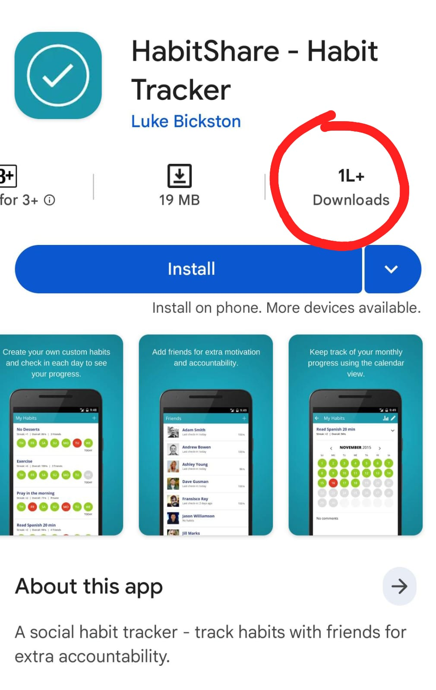
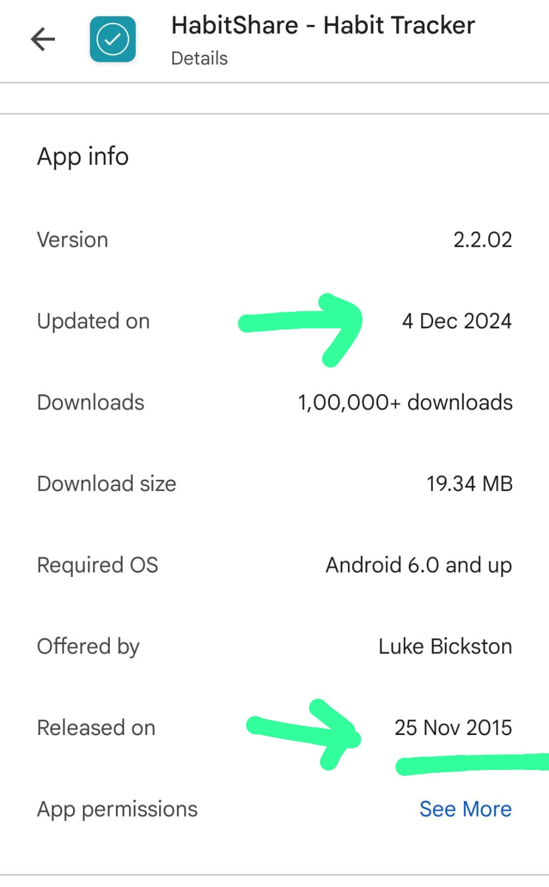
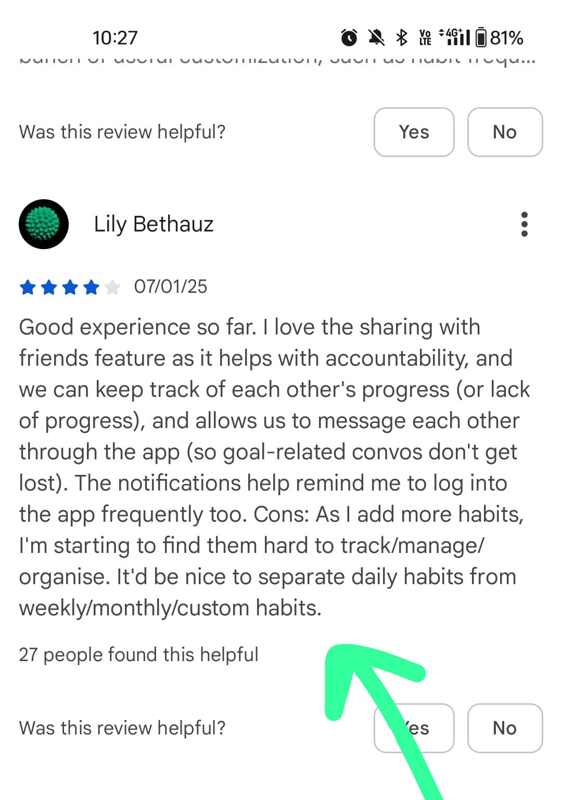
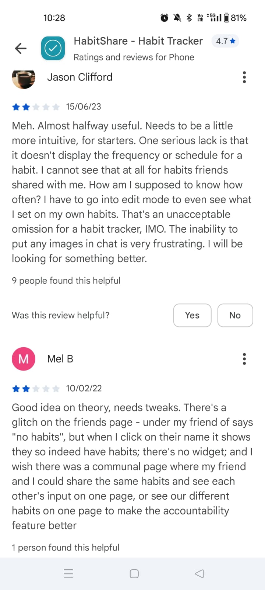
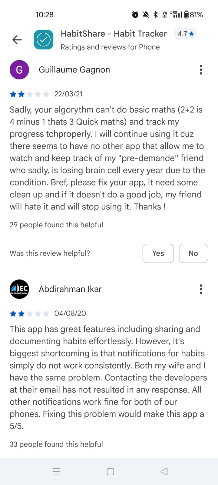

# HabitCircle — Product Document

---

## Problem Statement

Habits die in isolation. Every habit tracker on the market is built for one person sitting alone with their phone. But human beings do not build habits alone — they build them inside relationships. A mother wants to know her son is drinking water. A husband and wife want to stay accountable to each other. A coach wants to verify a client's morning routine. A friend wants to call you out when you slip.

The existing tools give you two bad choices: a solo tracker nobody else can see, or a public social feed that turns your personal struggles into performance. Neither is the real thing. The real thing is a small, trusted circle of people who care whether you showed up today.

HabitCircle is the habit tracker built for that circle.

---

## Validation

**The demand is already proven — HabitShare has 1,00,000+ downloads with a single developer, last updated Dec 2024, released Nov 2015.** A solo dev, no marketing budget, 9 years old, still getting downloads. The concept works. The execution is broken.

**The reviews tell you exactly what is broken and what to build:**

> *"There seems to be no other app that allows me to watch and keep track of my friend who is losing brain cell every year due to his condition."*
> — Guillaume Gagnon, 2/5, Mar 2021 (29 people found this helpful)

This is a caregiver watching a friend with a degenerative condition. He is still using a broken app because nothing else exists. This is not a casual user. This is someone with a real, painful, unmet need.

> *"Notifications for habits simply do not work consistently. Both my wife and I have the same problem. Fixing this would make it a 5/5."*
> — Abdirahman Ikar, 2/5, Aug 2020 (33 people found this helpful)

Husband and wife using it together. The social use case is proven. The product is just unreliable.

> *"I cannot see the frequency or schedule for a habit my friend shared with me. I have to go into edit mode to see my own habit schedule. That is an unacceptable omission."*
> — Jason Clifford, 2/5, Jun 2023

Core visibility is broken. You cannot even see how often your friend is supposed to do the habit.

> *"I wish there was a communal page where my friend and I could share the same habits and see each other's input on one page."*
> — Mel B, 2/5, Feb 2022

Users are asking for exactly the shared habit space we are building.

> *"I love the sharing feature. We can track each other's progress and message each other through the app so goal-related conversations don't get lost. Cons: habits get hard to manage as you add more — need to separate daily from weekly from monthly."*
> — Lily Bethauz, 4/5, Jan 2025 (27 people found this helpful)

Positive validation of the core concept. Clear product gap: habit organisation by frequency.

**Summary of validated demand:**
- Caregiver monitoring (asymmetric, high-stakes, no alternative exists)
- Couples / family accountability (symmetric, high-trust)
- Friend accountability (peer-to-peer, low-stakes)
- Shared habits where two people log together on one habit

---

## The Gap

HabitShare proved the concept. It failed the execution. Here is the exact gap:

| What Users Need | What HabitShare Gives | Gap |
|---|---|---|
| Reliable notifications | Broken, inconsistent | Fix reliability — this alone is a reason to switch |
| See friend's habit schedule | Hidden in edit mode, invisible for shared habits | First-class visibility of frequency and schedule |
| Shared habit space (both log to one habit) | Not possible — each person has separate habits | Build communal habits |
| Asymmetric monitoring (caregiver / parent / coach) | Only peer-to-peer friends | Build the Tracker / Witness role model |
| Habit organisation by frequency | Flat list, no separation | Daily / Weekly / Monthly tabs |
| n witnesses per habit | Limited | No cap on witnesses per habit |
| In-app goal-focused messaging | Basic, no images | Contextual chat per habit, not a general inbox |
| Widgets | None | Home screen widget showing today's habits + circle status |
| Bug-free friends page | Shows "no habits" when they do have habits | Basic QA |

---

## Competitive Landscape

### Direct Competitors

**HabitShare** *(most important)*
- 1,00,000+ downloads, solo dev (Luke Bickston), released 2015, last updated Dec 2024
- 4.7 stars but top critical reviews all cite the same bugs
- Peer-to-peer only — no asymmetric monitoring
- No shared habits (each person has separate logs)
- Notifications are broken
- No widgets
- Abandoned-feeling product, zero marketing, no response to support emails
- **Verdict: Market is proven, product is neglected. This is our direct gap.**

    

**Habitica**
- Gamified RPG habit tracker, large user base (~4M registered)
- Social guilds and parties but not accountability-focused
- Party members can see your check-ins but the point is XP, not accountability
- No asymmetric roles, no caregiver use case
- Heavy gamification turns off serious users
- **Verdict: Different audience. Not a direct threat.**

**Coach.me**
- Accountability coaching app, now pivoted toward professional coaching marketplace
- Coach (professional) monitors client — asymmetric, but paid professional relationship
- No peer/family/friend use case
- Expensive ($15–$99/month with a coach)
- **Verdict: B2B coaching wedge. Not consumer accountability.**

**Streaks (iOS only)**
- Beautiful solo habit tracker, Apple Design Award winner
- No social features whatsoever
- iOS only
- **Verdict: No overlap. Different product.**

**Beeminder**
- Financial accountability — you pledge money, you pay if you fail
- No social/monitoring layer
- Niche power-user audience
- **Verdict: Different mechanism. No overlap.**

**Focusmate**
- Work session accountability via live video call
- Not habit tracking — session-based
- **Verdict: No overlap.**

**Accountable2You**
- Asymmetric accountability — monitors your device usage and reports to a partner
- Screen time / content filtering focus (marketed toward addiction recovery, parenting)
- Not habit creation — it watches what you do on your phone, not what you declare you will do
- **Verdict: Adjacent use case (asymmetric monitoring) but different mechanism entirely.**

**Done: A Habit Tracker**
- Clean solo tracker with basic sharing
- Sharing is shallow — friends can see streaks, not logs
- No communal habits, no witness roles
- **Verdict: Solo tracker with social veneer. Not a competitor.**

### Comparison Table

| Feature | HabitCircle | HabitShare | Habitica | Coach.me | Streaks |
|---|---|---|---|---|---|
| Shared habits (both log together) | Yes | No | No | No | No |
| Asymmetric roles (Tracker / Witness) | Yes | No | No | Yes (paid) | No |
| n Witnesses per habit | Yes | No | No | No | No |
| Witness can create habit for Tracker | Yes (with consent) | No | No | No | No |
| Reliable notifications | Yes (priority) | No (broken) | Partial | Yes | Yes |
| Habit frequency visible to Witness | Yes | No | N/A | N/A | N/A |
| Home screen widget | Yes | No | No | No | Yes |
| Habit organisation by frequency | Yes | No | No | N/A | Yes |
| In-app contextual chat per habit | Yes | Basic | Guild chat | Yes | No |
| Price | Freemium | Free | Free/Premium | $15+/mo | $4.99 one-time |
| Caregiver use case | Yes | Broken | No | No | No |
| India market focus | Yes | No | No | No | No |

---

## Technical Solution

### Core Concept: Roles

Every user has one identity. Their role is per-habit, not per-account.

**Tracker** — the person doing the habit. Creates the habit, logs completion, controls who can witness.

**Witness** — the person watching. Can see the Tracker's log, send a nudge (one tap), optionally track the same habit for themselves.

A user can be a Tracker on some habits and a Witness on others simultaneously. The app shows both views in one unified feed.

### Data Model (simplified)

```
Users
  id, name, email, phone, avatar, created_at

Habits
  id, creator_id, title, description, frequency (daily/weekly/monthly/custom),
  target_count, is_shared, created_at

HabitMembers
  id, habit_id, user_id, role (tracker/witness), 
  can_create_habits_for_tracker (bool), accepted_at, invited_at

HabitLogs
  id, habit_id, user_id, logged_at, note (optional), media_url (optional)

Nudges
  id, habit_id, from_user_id, to_user_id, sent_at, message (optional)

HabitChats
  id, habit_id, user_id, message, media_url, sent_at
```

### The Permission Model

The Tracker controls everything:
- Who can witness (invite by phone number / link)
- What each Witness can see (full log / streak only / just today)
- Whether a Witness can create habits for them
- Whether the habit is shared (both log to same record) or mirrored (separate logs, side-by-side view)

Witness powers (within what Tracker allows):
- View logs
- Send nudge (one tap, no message required)
- Send a message in that habit's chat thread
- Log their own completion if it's a shared habit
- Create a new habit for the Tracker (only if Tracker granted this permission)

### Notification Architecture (fix HabitShare's #1 bug)

HabitShare's broken notifications are its biggest churn driver. HabitCircle treats notifications as infrastructure, not a feature.

- FCM (Firebase Cloud Messaging) for Android, APNs for iOS
- Per-habit notification schedule stored server-side, not device-side (survives reinstalls, device changes)
- Delivery receipt tracking — if a habit reminder does not deliver within 5 minutes, retry with exponential backoff
- Witness nudge → push notification with one-tap log button directly in the notification shade
- Weekly digest to Witnesses: "Your circle logged X habits this week" — keeps Witnesses engaged without opening the app

### Shared Habit Space

A shared habit has one log, two contributors. Both Tracker and Witness check in independently. The habit card shows:

```
Drink 2L Water — Daily
  [You: ✓ Today]   [Mom: ✓ Today]   [Streak: 12 days together]
```

Both people are accountable to each other, not just one watching the other.

### Habit Organisation

Three tabs in the habit feed:
- **Daily** — needs to be done today
- **Weekly** — needs to be done N times this week
- **Monthly / Custom** — everything else

Witnesses see the same organisation for the Trackers they watch. Frequency is always visible — no more "how often is this habit?" confusion.

---

## Gaps HabitCircle Solves (Mapped to Reviews)

| Review complaint | HabitCircle fix |
|---|---|
| "Can't track my friend's habits as a caregiver" | Witness role with asymmetric monitoring, caregiver explicitly supported |
| "Notifications don't work" | Server-side scheduling, FCM/APNs with delivery receipts |
| "Can't see friend's habit frequency" | Frequency displayed on every shared habit card |
| "Wish we could share one habit and both log to it" | Shared habits — one habit, two contributors |
| "Hard to organise habits as the list grows" | Daily / Weekly / Monthly tabs |
| "No widget" | Home screen widget showing today's habits + circle status |
| "Friends page shows no habits (bug)" | Server-side sync, no client-side caching bugs |
| "Goal conversations get lost" | Per-habit chat thread, isolated from general messaging |

---

## MVP 1

### What MVP 1 Must Prove

One question: **Does being watched by one person you trust make you more likely to complete a habit for 14 days straight?**

Target: 100 users, 3 weeks, at least one Witness added per user.

### What Ships in MVP 1

**1. Solo habit tracking**
- Create habit (title, frequency, optional description)
- Log completion — one tap
- Streak counter
- Daily / Weekly / Monthly tabs
- Home screen widget (Android)

**2. Witness system (core differentiator)**
- Invite a Witness by phone number or shareable link
- Witness accepts and can view your habit log
- Habit frequency and schedule visible to Witness
- Witness can send a nudge (one tap — "I'm watching")
- Tracker sees nudge as a notification + in-feed

**3. Shared habits**
- Tracker can mark any habit as shared
- Both Tracker and Witness can log independently
- Habit card shows both completion states side-by-side
- Shared streak counter (only increments if both logged)

**4. Reliable notifications**
- Daily habit reminders (server-side scheduled)
- Nudge push notification with one-tap log from notification shade
- If not delivered within 5 min, retry once

**5. Basic in-app chat per habit**
- One thread per habit, visible to all members of that habit
- Text only in MVP 1 (images in v1.1)

### What Is NOT in MVP 1

| Feature | Why excluded | When |
|---|---|---|
| Witness creates habits for Tracker | Adds consent flow complexity | v1.1 |
| Compare view (side-by-side analytics) | Need data first | v1.1 |
| Multiple witnesses per habit | Build with one first, validate | v1.1 |
| Thompson Sampling notifications | Need open/ignore data | v1.1 |
| Monthly / Year report | No data yet | v2 |
| iOS app | Android-first, India market | v1.1 |

### Build Sequence

```
Week 1–2 — Foundation
  Auth (phone number OTP — India default)
  Habit CRUD
  Daily log + streak
  Daily / Weekly / Monthly tabs

Week 3–4 — Witness System
  Invite flow (link + phone)
  Witness can view Tracker's log
  Habit frequency visible to Witness
  Nudge (one tap) + push notification

Week 5 — Shared Habits
  Shared habit creation
  Both-log mechanic
  Shared streak counter
  Side-by-side today card

Week 6 — Notifications + Widget
  Server-side scheduled reminders
  Delivery receipts + retry
  Android home screen widget
  Per-habit chat thread

Week 7 — Polish + 100 user test
  Bug fixes
  Onboarding (2 screens max — name, first habit, invite one person)
  Play Store submission
```

### What You Are Watching

| Metric | Threshold | What it means |
|---|---|---|
| % who add at least one Witness | > 60% | The social mechanic has pull |
| Day-14 retention | > 20% (vs 3–4% category baseline) | Accountability is working |
| Shared habit adoption | > 30% of habits marked shared | Communal logging resonates |
| Nudge send rate | > 1 nudge/week per Witness | Witnesses are actually engaged |
| Notification delivery rate | > 95% | We fixed HabitShare's core bug |

If day-14 retention is above 20%, we have something HabitShare never had — a retention signal worth building on. That is when v1.1 scope opens.

---

## Premium Analytics — Day 21 Paywall

### The Strategy

The CTO memo killed "Me vs Me" as a standalone app because the payoff was gated to day 90 — after the churn cliff. HabitCircle solves this structurally: users are already logging daily because of social accountability (their Witness is watching). By day 21 they have enough real data. That is when analytics unlock — not as a cold upsell, but as a "look what your data already says" reveal.

**The hook:** At day 21, the app shows a partially visible insight card:

> *"On days your mom nudged you, you completed your habit 73% of the time. On days without a nudge: 41%."*

The number is real. It is blurred below the first line. One CTA: **Unlock your pattern — ₹149/month.**

The paywall is not arbitrary. 21 days is the minimum for the statistics to be honest. We do not show it at day 7 because the data is not ready. We show it at day 21 because it is.

---

### Two Types of Premium Insights

#### Type 1 — Me vs Me (Self-Comparison)

Compare yourself to your own rolling baseline — not your best month (the CTO memo correctly killed that), but your **EWMA rhythm**: the version of you that your last 19 days of logged data says is normal.

**What it shows:**
- Completion rate this week vs your 19-day EWMA baseline
- Trend: improving / stable / declining (>10% delta = directional signal)
- Best day of the week for this habit (purely from logged data)
- Best time of day you tend to log (if time-stamped)
- Streak quality: not just consecutive days, but what % of those days were logged before 10 PM (proxy for intention vs last-minute)

**Example insight (week 4):**
> *"Your water habit completion rate this week: 86%. Your rhythm over the past 3 weeks: 61%. You are 25 points above your own baseline — your best week yet."*

**Why this is statistically honest (CTO memo response):**
- EWMA (λ=0.1) is a smoothing formula, not a correlation. No p-values, no autocorrelation risk. Just a weighted average. Completely defensible.
- Trend lines compare weekly average to 4-week rolling average. Direction defined as: >10% = improving, < -10% = declining, between = stable. Pure arithmetic.
- No causal language. Never "sleep caused this." Always "on weeks when X was high, Y tended to be higher."

---

#### Type 2 — Circle Correlation (Witness Analytics)

This is the genuinely novel insight no other habit app can produce: **does your circle make you more consistent, and under what conditions?**

**What it shows:**
- Nudge effect: completion rate on nudge days vs non-nudge days
- Witness activity correlation: on weeks your Witness was active (logged their own habits), were you more consistent too?
- Shared habit sync: if both people log a shared habit, what is the shared streak vs solo streak ratio?
- Circle momentum: "Your whole circle had their best week in month 2. What was different?"

**Example insights:**

> *"On days your Witness sent you a nudge, you completed this habit 71% of the time. On other days: 38%. The nudge effect is strong in your data."*

> *"Weeks your mom logged her own habits, your completion rate averaged 79%. Weeks she did not log: 52%. You are more consistent when she is too."*

> *"Your shared streak with your sister is 18 days. Your solo streak on habits without a Witness: 4 days. Accountability is your multiplier."*

**Why this is statistically honest (CTO memo response):**

The CTO memo raised three valid statistical concerns. Here is how each is fixed:

**Problem 1 — Autocorrelation inflates Pearson p-values.**
Daily human time series are serially correlated. Standard Pearson assumes independence.

Fix: Run Ljung-Box test on each series before computing correlation. If autocorrelation is detected (p < 0.05), fit an AR(1) model and use the residuals for Pearson — not the raw series. This is called prewhitening. The insight only surfaces if the prewhitened correlation clears all thresholds.

**Problem 2 — Multiple comparisons inflate false positives.**
Testing many variable pairs means some will look significant by chance.

Fix: Cap at 4 insight pairs per user per habit. Apply Bonferroni correction: divide the significance threshold by the number of tests. 4 tests → threshold becomes p < 0.0125, not p < 0.05. Harder to pass. Fewer false positives.

**Problem 3 — Small N and causal framing.**
21 days is a thin sample. Framing correlations as causes is dishonest.

Fix: Minimum N = 28 days of joint data (both Tracker and Witness logging) before any correlation insight surfaces. Language is always correlational: "tends to be higher when," "in your data, X and Y move together," never "X causes Y." Each insight card shows the sample size: *"Based on 34 days of data."*

**The guards (revised from CTO memo feedback):**
- N ≥ 28 days of joint data (up from 21)
- |r| > 0.4 after prewhitening (reduced from 0.5 to account for correction overhead)
- p < 0.0125 after Bonferroni (not raw p < 0.05)
- Autocorrelation test must pass (Ljung-Box Q-stat, lag 7)
- All four guards must pass. If any fails, the insight is not shown. No exceptions.

---

### Pricing Tiers

| Tier | Price | What unlocks |
|---|---|---|
| **Free** | ₹0 | Habit tracking + 1 Witness per habit + streak + nudges |
| **Me vs Me** | ₹99/month | Self-comparison analytics (EWMA baseline, trend, best day/time) + 3 Witnesses per habit |
| **Circle** | ₹199/month | Everything in Me vs Me + Witness correlation analytics + 5 Witnesses per habit |
| **Circle Pro** | ₹349/month | Everything + unlimited Witnesses + caregiver dashboard (dedicated Witness view for high-stakes monitoring) |

**Why more Witnesses = higher price:**
Each additional Witness is a new user acquisition vector (Witness downloads the app too). But more Witnesses also means more server-side data processing and more notification load. The pricing reflects both the value delivered and the cost.

**Why the paywall is at day 21 and not earlier:**
- Day 7: Too early. EWMA baseline needs at least 2–3 weeks to stabilise. Showing insights from 7 days would produce noisy, potentially misleading results. Users would feel misled.
- Day 14: Borderline. Possible for Me vs Me (EWMA has ~10 data points), but not enough joint data for Circle correlations.
- Day 21: First honest moment. EWMA baseline has meaningful weight. If both Tracker and Witness have been active, joint N approaches 28. The insight is real.
- Day 90: Too late (the CTO memo's core criticism of Me vs Me standalone). Most users would have churned. HabitCircle solves this by building retention through social accountability first — users are already invested before analytics unlock.

---

### The Day 21 Screen (UX)

The user opens the app on day 21. A new card appears above their habit feed:

```
┌─────────────────────────────────────────────┐
│  📊  Your first pattern is ready             │
│                                             │
│  "On days your mom nudged you, you          │
│   completed Water at 73% —"                 │
│                                             │
│  ░░░░░░░░░░░░░░░░░░░░░░░░░░░░░░░░░░        │
│  ░ [blurred: rest of insight] ░░░░░░        │
│  ░░░░░░░░░░░░░░░░░░░░░░░░░░░░░░░░░░        │
│                                             │
│  Based on 21 days of real data.             │
│                                             │
│  [ Unlock your pattern — ₹149/month ]       │
│  [ Maybe later ]                            │
└─────────────────────────────────────────────┘
```

The first line is real and unblurred. The user sees a number that is specifically about them. The blur is not a fake — the rest of the insight is computed and waiting. They are not being sold a promise. They are being sold access to something that already exists.

This is the difference between a paywall and a reveal.
